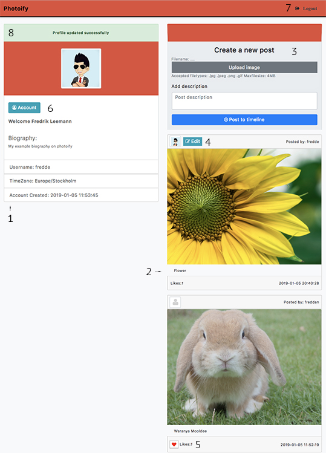
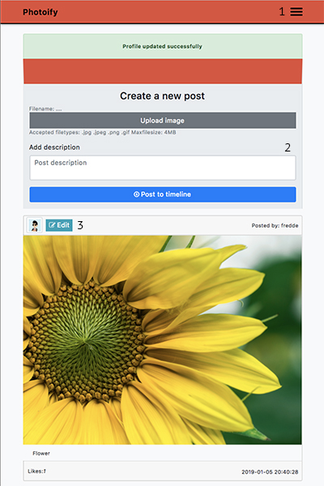
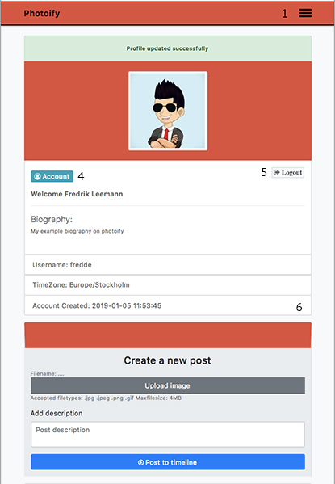

## Assignment in PHP ( photoify ) - Yrgo

> Christmas assignment 2018 in PHP at Yrgo in Sweden Gothenburg. Deadline for: 2019-01-17 09:00 
This assignment is called photoify and is a supposed to mimic instagram functionalities like user account creation, log in features + more

_Languages Used:_  
_HTML CSS PHP SQL Javascript Markdown <- Readme.md_

**( In this project we use an sqlite database to store information )**

[Code License: MIT](https://choosealicense.com/licenses/mit/)

### Installation:
1. [Click this link to download this project as a zip-file](assets/photoify.zip?raw=true)
3. Extract the compressed zip-archive to the root of your webserver
4. Change the root to point to photoify or photoify-master depending on how you downloaded the project
5. Start or restart your webserver to load the services and apply the new configuration
6. Scroll down this readme for screenshots and to read about usage

Guide to change the root in MAMP on Mac/Windows: 
[mamp-how-to-change-the-root-directory-on-apache-server](https://ruifeio.com/2014/08/08/mamp-how-to-change-the-root-directory-on-apache-server/)

###### Example Servers and links:
- [XAMPP](https://www.apachefriends.org/index.html "Download XAMPP for Windows Linux Mac")
- [WAMP](https://bitnami.com/stack/wamp/installer "Download WAMP for Windows Mac Linux")
- [MAMP](https://www.mamp.info/en/downloads "Download MAMP for Mac Windows")
- [LAMP Ubuntu](https://www.digitalocean.com/community/tutorials/how-to-install-linux-apache-mysql-php-lamp-stack-ubuntu-18-04 "Install LAMP on Ubuntu Linux")
- [LAMP CentOS6](https://www.digitalocean.com/community/tutorials/how-to-install-linux-apache-mysql-php-lamp-stack-on-centos-6 "Install LAMP on CentOS6 Linux")
- [LAMP CentOS7](https://www.digitalocean.com/community/tutorials/how-to-install-linux-apache-mysql-php-lamp-stack-on-centos-7 "Install LAMP on CentOS7 Linux")
- [Git-GUI](https://desktop.github.com/ "Downloads for Mac Windows")
- [Git-CLI](https://git-scm.com/downloads "Downloads for Mac Windows Linux/Unix")

> Download GIT-CLI or GIT-GUI if you need or want to clone this repository to your computer...

#### Usage:
1. Connect to localhost with your browser (preferably google chrome or mozilla firefox)
2. On the login page you may create a new account by clicking on "Don´t have an account ?"
3. Sign in through the login form and you will be directed to account.php
4. See the screenshots below for desktop and mobile views...

##### Desktop
1. Profile-module and overview
2. Timeline for posts
3. Create post-module
4. Button to edit/delete post (Will only appear on user's own posts)
5. Like-button for posts (Won't appear on user's own posts) 
6. Button to edit/delete your account and all of its content
7. Link to log out from your account and end your session
8. Errors and success messages will appear here

##### Mobile
1. Menu to toggle profile-module and overview
2. Create post-module
3. Button to edit/delete post (Will only appear on user's own posts)
4. Button to edit/delete your account and all of its content
5. Link to log out from your account and end your session
6. Profile-module and overview

 

#### Functions:

###### This project incorporates below functionalities:
* [x] User account creations
* [x] Login functionalities
* [x] Logout functionalities
* [x] Functionality to edit your account
* [x] Uploading of new avatar images
* [x] Creations of new posts with images and description
* [x] Edit published posts
* [x] Delete published posts
* [x] like/unlike content
* [x] Delete your account and all of it´s content

#### Testers:
Name|OS|Browser|Status
-|-|-|-
[Erik Arvidsson](https://github.com/erikarvidsson "Erik Arvidsson GitHub")|macOS Mojave 10.14|Google Chrome 71.0.3578.98|Working
[Charmaine Wang](https://github.com/charmaine-wang "Charmaine Wang GitHub")|macOS High Sierra 10.13.6|Google Chrome 71.0.3578.98|Working
[Charmaine Wang](https://github.com/charmaine-wang "Charmaine Wang GitHub")|Iphone IOS 12.1.2|Safari 12.1.2|Working
[Maria Eidland](https://github.com/mariaeid "Maria Eidland GitHub")|Windows 10 Home|Mozilla Firefox 64.0|Working
[Ida Hallner](https://github.com/idahal "Ida Hallner GitHub")|Windows 10 Home|Google Chrome 7.x|Working
[Fredrik Leemann](https://github.com/freddan88 "Fredrik Leemann GitHub")|macOS Yosemite 10.10.5|Mozilla Firefox 65.0b5|Working
[Fredrik Leemann](https://github.com/freddan88 "Fredrik Leemann GitHub")|macOS Yosemite 10.10.5|Google Chrome 72.0.3626.28|Working
[Fredrik Leemann](https://github.com/freddan88 "Fredrik Leemann GitHub")|macOS High Sierra 10.13.6|Google Chrome 71.0.3578.98|Working
[Fredrik Leemann](https://github.com/freddan88 "Fredrik Leemann GitHub")|macOS High Sierra 10.13.6|Mozilla Firefox 65.0b8|Working
[Fredrik Leemann](https://github.com/freddan88 "Fredrik Leemann GitHub")|macOS High Sierra 10.13.6|Safari 11.1.2|Working
[Fredrik Leemann](https://github.com/freddan88 "Fredrik Leemann GitHub")|Windows 7 Home Premium SP1|Google Chrome 71.0.3578.98|Working
[Fredrik Leemann](https://github.com/freddan88 "Fredrik Leemann GitHub")|Windows 7 Home Premium SP1|Mozilla Firefox 63.0.3|Working

#### Resources:

##### Favicon:
[Favicon.io](https://favicon.io "The best Favicon Generator - completely free")

###### Credits: [John Sorrentino](https://twitter.com/johnsorrentino "John Sorrentino Twitter profile")

###### [Downloadpage here](https://favicon.io/emoji-favicons/busts-in-silhouette/)

###### _CSS framework_
[Bootstrap](https://getbootstrap.com/ "The most popular HTML, CSS, and JS library in the world")

###### _CSS Sanitize CDN_
[CDN link here](https://cdnjs.com/libraries/10up-sanitize.css "10up-sanitize.css - cdnjs.com")

###### _Font Awesome 4.7:_
* [Font Awesome 4.7 CDN](https://www.bootstrapcdn.com/fontawesome/ "Font Awesome - BootstrapCDN by StackPath")
* [Font Awesome 4.7 Icons](https://fontawesome.com/v4.7.0/icons/ "Font Awesome Icons")

##### Markdown quick reference cheat sheet
[Markdown cheat sheet](https://en.support.wordpress.com/markdown-quick-reference/ "Markdown quick reference cheat sheet")

##### Links to stackoverflow
[Images in markdown](https://stackoverflow.com/questions/31558605/zoomable-image-in-markdown "Zoomable image in markdown - Stackoverflow")

[Images side by side](https://stackoverflow.com/questions/24319505/how-can-one-display-images-side-by-side-in-a-github-readme-md "How can one display images side by side in a GitHub README.md? - Stackoverflow")

---

YRGO - Christmas Assignment 2018 ( PHP ) - 2019-01-17 09:00 URL [www.leemann.se/fredrik](http://www.leemann.se/fredrik)
